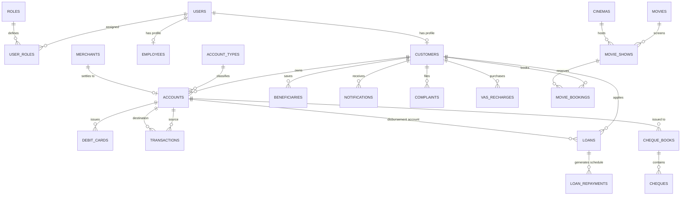

# 🗄️ Database Schema & Entity Relationship (ER) Model

The **Godavari Bank Online Management System** runs on a relational **MySQL 8.0** schema with **InnoDB** storage engine, ensuring strict foreign key constraints, ACID compliance, and transactional row-level locking.

---

## 1. Entity Relationship (ER) Diagram



---

## 2. Core Relational Tables & Data Dictionary

### 2.1 `users`
Stores login credentials, user type, and account lockout status.
| Column | Type | Constraints | Description |
| :--- | :--- | :--- | :--- |
| `id` | `BIGINT` | `PK`, `AUTO_INCREMENT` | Unique User ID |
| `username` | `VARCHAR(50)` | `NOT NULL`, `UNIQUE` | Login username |
| `password` | `VARCHAR(120)` | `NOT NULL` | BCrypt encrypted hash |
| `email` | `VARCHAR(100)` | `NOT NULL`, `UNIQUE` | Registered email |
| `mobile` | `VARCHAR(15)` | `NOT NULL` | 10-digit mobile number |
| `user_type` | `VARCHAR(20)` | `NOT NULL` | `CUSTOMER` or `EMPLOYEE` |
| `enabled` | `BOOLEAN` | `DEFAULT TRUE` | Account activation flag |
| `account_non_locked`| `BOOLEAN` | `DEFAULT TRUE` | Lockout status flag |
| `failed_login_attempts`| `INT` | `DEFAULT 0` | Consecutive failed attempts |
| `lock_time` | `DATETIME` | `NULLABLE` | Timestamp when locked |
| `created_at` | `DATETIME` | `NOT NULL` | Record creation timestamp |
| `updated_at` | `DATETIME` | `NOT NULL` | Record update timestamp |

---

### 2.2 `customers`
Stores customer KYC, residential, identity, and transaction PIN credentials.
| Column | Type | Constraints | Description |
| :--- | :--- | :--- | :--- |
| `id` | `BIGINT` | `PK`, `AUTO_INCREMENT` | Internal identifier |
| `user_id` | `BIGINT` | `FK -> users.id`, `UNIQUE` | Associated login user |
| `customer_id` | `VARCHAR(20)` | `NOT NULL`, `UNIQUE` | Bank CIF number (e.g. `CUST100001`) |
| `first_name` | `VARCHAR(50)` | `NOT NULL` | Customer first name |
| `last_name` | `VARCHAR(50)` | `NOT NULL` | Customer last name |
| `gender` | `VARCHAR(10)` | `NOT NULL` | Gender |
| `date_of_birth` | `DATE` | `NOT NULL` | Date of birth |
| `pan_number` | `VARCHAR(10)` | `NOT NULL`, `UNIQUE` | Income tax PAN Card |
| `aadhaar_number`| `VARCHAR(12)` | `NOT NULL`, `UNIQUE` | 12-digit Aadhaar UID |
| `address` | `VARCHAR(255)`| `NOT NULL` | Residential address |
| `city` | `VARCHAR(50)` | `NOT NULL` | City |
| `state` | `VARCHAR(50)` | `NOT NULL` | State |
| `pincode` | `VARCHAR(10)` | `NOT NULL` | Postal PIN code |
| `occupation` | `VARCHAR(50)` | `NOT NULL` | Profession / Employment |
| `annual_income` | `DECIMAL(15,2)`| `NOT NULL` | Annual earnings |
| `nominee_name` | `VARCHAR(100)`| `NULLABLE` | Nominee name |
| `nominee_relation`| `VARCHAR(50)`| `NULLABLE` | Relationship to nominee |
| `transaction_pin`| `VARCHAR(120)`| `NOT NULL` | BCrypt encrypted 4-digit PIN |
| `pin_failed_attempts`| `INT` | `DEFAULT 0` | PIN failure count |
| `pin_locked_until`| `DATETIME` | `NULLABLE` | PIN cooldown lockout timer |

---

### 2.3 `accounts`
Stores bank account balances, ledger states, and branch affiliations.
| Column | Type | Constraints | Description |
| :--- | :--- | :--- | :--- |
| `id` | `BIGINT` | `PK`, `AUTO_INCREMENT` | Internal account ID |
| `customer_id` | `BIGINT` | `FK -> customers.id` | Account holder |
| `account_number`| `VARCHAR(20)` | `NOT NULL`, `UNIQUE` | Core account number (`SBIN...`) |
| `account_type_id`| `BIGINT` | `FK -> account_types.id` | `SAVINGS` or `CURRENT` |
| `balance` | `DECIMAL(15,2)`| `NOT NULL` | Available liquid balance |
| `ledger_balance`| `DECIMAL(15,2)`| `NOT NULL` | Total book ledger balance |
| `status` | `VARCHAR(20)` | `NOT NULL` | `ACTIVE`, `DORMANT`, `FROZEN`, `CLOSED` |
| `ifsc_code` | `VARCHAR(15)` | `NOT NULL` | Branch IFSC code (`GDVB000123`) |
| `branch_name` | `VARCHAR(100)`| `NOT NULL` | Branch designation |
| `opening_date` | `DATE` | `NOT NULL` | Account activation date |

---

### 2.4 `transactions`
Immutable financial double-entry transaction record.
| Column | Type | Constraints | Description |
| :--- | :--- | :--- | :--- |
| `id` | `BIGINT` | `PK`, `AUTO_INCREMENT` | Internal ID |
| `transaction_ref`| `VARCHAR(30)` | `NOT NULL`, `UNIQUE` | Reference ID (`TXN...`) |
| `from_account_id`| `BIGINT` | `FK -> accounts.id`, `NULLABLE` | Source debit account |
| `to_account_id` | `BIGINT` | `FK -> accounts.id`, `NULLABLE` | Target credit account |
| `amount` | `DECIMAL(15,2)`| `NOT NULL` | Transaction rupee amount |
| `type` | `VARCHAR(30)` | `NOT NULL` | `TRANSFER`, `DEPOSIT`, `WITHDRAWAL`, `EMI_PAYMENT`, `VAS_RECHARGE`, `VAS_MOVIE`, `CASHIER_COUNTER` |
| `status` | `VARCHAR(20)` | `NOT NULL` | `SUCCESS`, `FAILED`, `PENDING` |
| `description` | `VARCHAR(255)`| `NOT NULL` | Transaction narration |
| `sender_balance_after`| `DECIMAL(15,2)`| `NULLABLE` | Balance snapshot |
| `receiver_balance_after`| `DECIMAL(15,2)`| `NULLABLE` | Balance snapshot |
| `created_at` | `DATETIME` | `NOT NULL` | Transaction timestamp |

---

### 2.5 `loans` & `loan_repayments`
Manages credit facilities, amortization schedules, and full settlement records.
* **`loans`**: Contains `loan_account_number`, `requested_amount`, `sanctioned_amount`, `interest_rate`, `tenure_months`, `monthly_emi`, `remaining_principal`, `remaining_emis`, `status` (`APPLIED`, `UNDER_REVIEW`, `ACTIVE`, `REJECTED`, `CLOSED`).
* **`loan_repayments`**: Contains `installment_number`, `due_date`, `principal_component`, `interest_component`, `total_installment_amount`, `paid_date`, `status` (`PENDING`, `PAID`, `OVERDUE`).

---

## 3. Database Indexes & Performance Optimization

```sql
-- Fast User & Customer Lookups
CREATE INDEX idx_users_username ON users(username);
CREATE INDEX idx_users_email ON users(email);
CREATE INDEX idx_customers_pan ON customers(pan_number);
CREATE INDEX idx_customers_aadhaar ON customers(aadhaar_number);

-- Real-Time Transaction Queries
CREATE INDEX idx_transactions_from_acc ON transactions(from_account_id);
CREATE INDEX idx_transactions_to_acc ON transactions(to_account_id);
CREATE INDEX idx_transactions_created_at ON transactions(created_at);

-- Account Concurrency
CREATE UNIQUE INDEX uq_accounts_num ON accounts(account_number);
```
